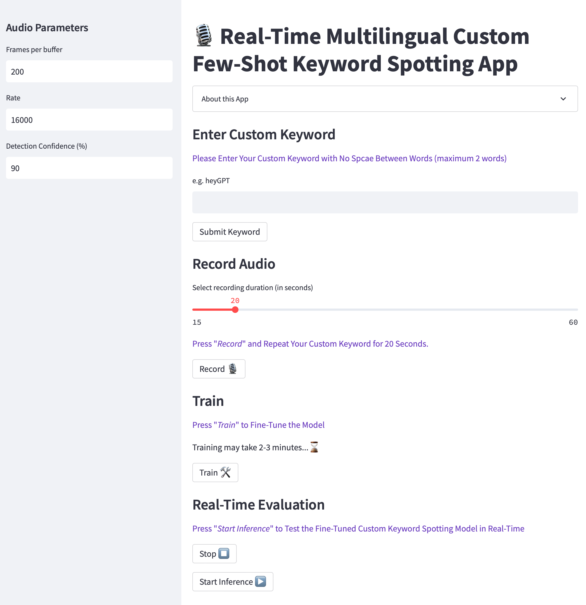

# Real-time Multilingual Custom Keyword Spotting via Few Shot Learning
- a low-latency few-shot keyword spotting (FS-KWS) for personalization of keyword spotting  or wakeword detection running in real-time on an edge device.
- customization achieved by recording audio from user for less than 30 seconds, then segmenting speaker's audio to 1-second speech audio files via a deep learning model. Segmented audio files then used to fine-tune and customize an efficinetnet-B0 based multilingual keyword spotting model through few-shot leanring. The baseline model that we used in this study is based on [harvard-edge](https://github.com/harvard-edge/multilingual_kws) work.
- Processing time for each 1-second audio chunk is 60 ms.


## Solution Architecture


## Component Setup - step by step
**1.** Clone the Project 
```
git clone https://github.com/nasim-alamdari/RealTime-Custom-Keyword-Spotting.git
cd RealTime-Custom-Keyword-Spotting
```

**2.** Import and install relevant libraries to your Python project. 
```
conda create --name kws
conda activate kws
pip install -r requirement.txt
```

**3. Enjoy real-time custom keyword spotting inside your streamlit app! 🎈**
```
cd Code
streamlit run streamlit_rltime_app.py
```


## Deployment via Streamlit:**



Feel free to reach out to me in case you have any questions! <br>
Pls consider leaving a `star` ☆ with this repository to show your support.

#### Contributors: 
[Nasim Alamdari](https://www.linkedin.com/in/nasim-alamdari/) and [Christos Magganas](https://www.linkedin.com/in/christos-magganas/)


